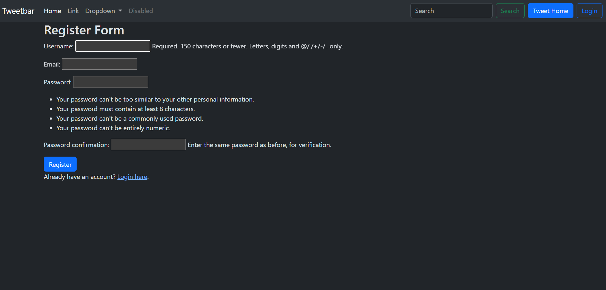
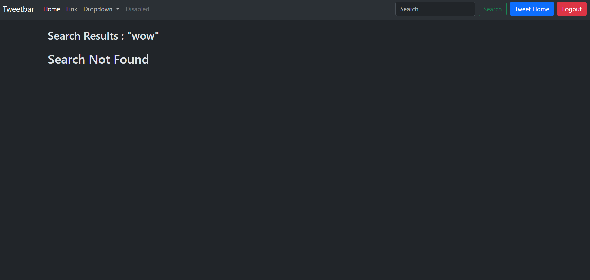
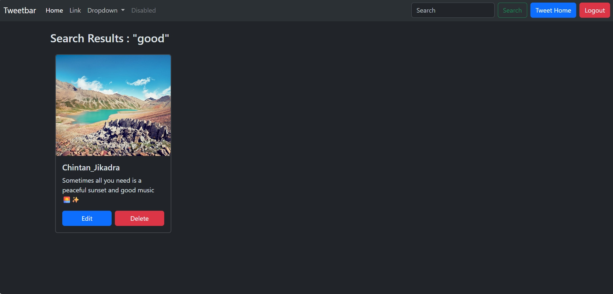
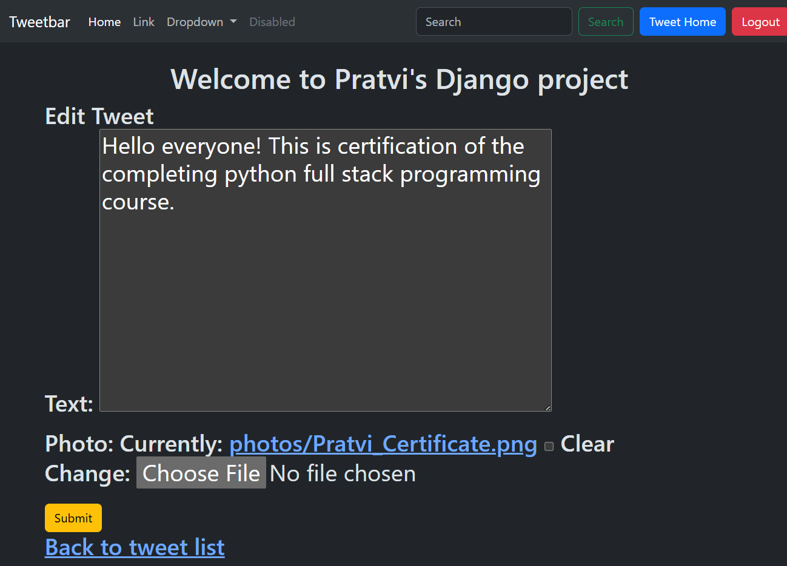
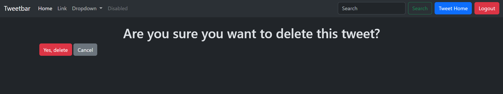
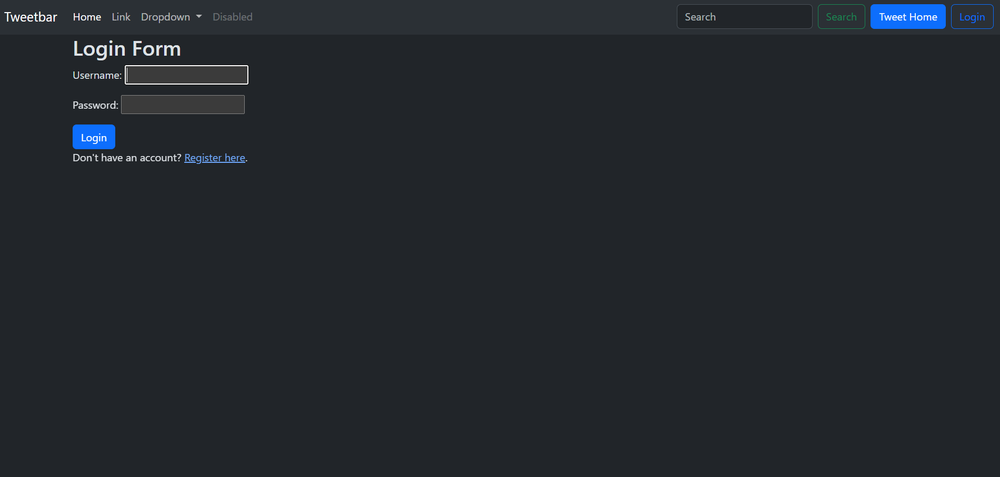
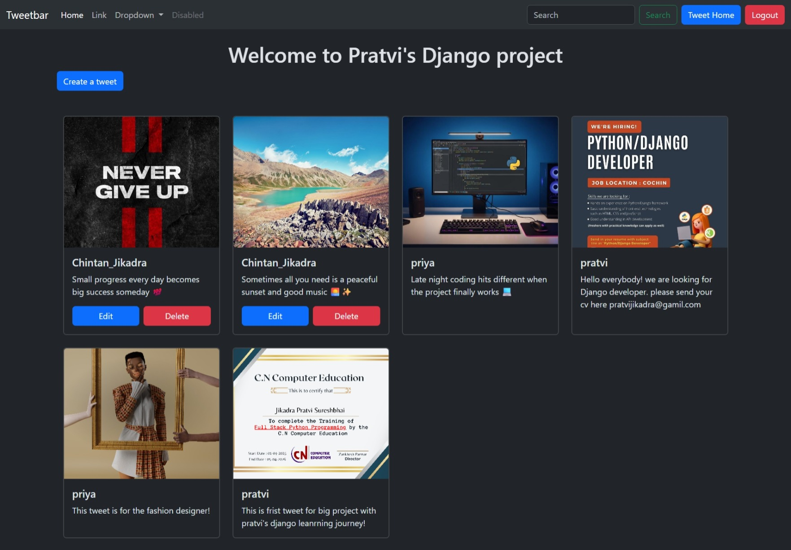

      


# Django Twitter Project

A Twitter-like web application built using Django framework with strong foundation of backend basics.

## Features

- User Authentication
- Create Tweet
- Edit Tweet
- Delete Tweet
- Upload Images
- Bootstrap Responsive UI
- Django Admin Panel
- only authenticated user can create tweet

## Technologies Used

- Python
- Django
- Bootstrap
- SQLite
- HTML
- CSS

## Installation

Clone the repository:

```bash
git clone https://github.com/Pratvijikadra/django-twitter-project.git
```

Go to project directory:

```bash
cd django-twitter-project
```

Create virtual environment:

```bash
python -m venv .venv
```

Activate virtual environment:

### Windows

```bash
.venv\Scripts\activate
```

Install dependencies:

```bash
pip install -r requirements.txt
```

Run migrations:

```bash
python manage.py migrate
```

Start development server:

```bash
python manage.py runserver
```

## Project Structure

```bash
django_with_pratvi/
tweet/
templates/
manage.py
```

## Author

Pratvi Jikadra

## GitHub Repository

https://github.com/Pratvijikadra/django-twitter-project